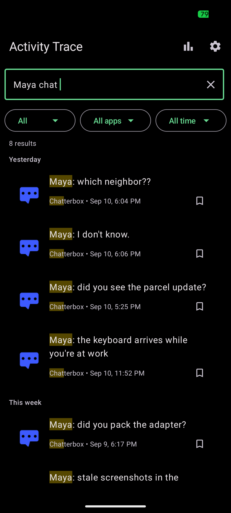
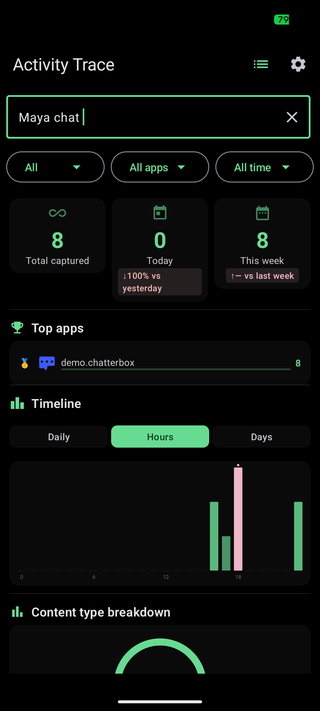
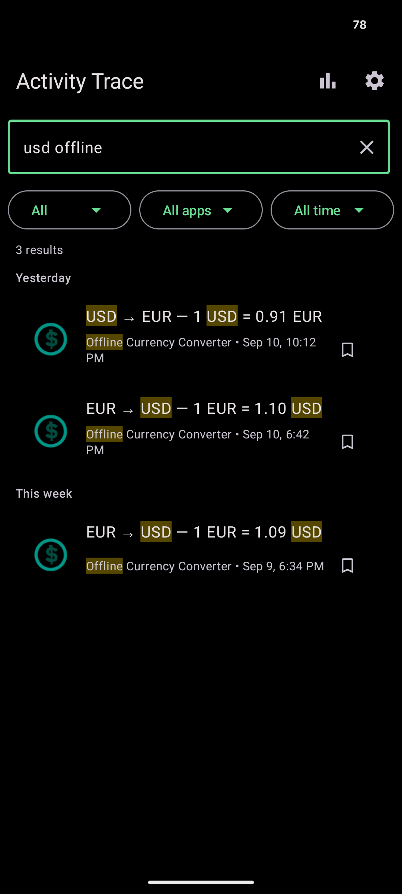
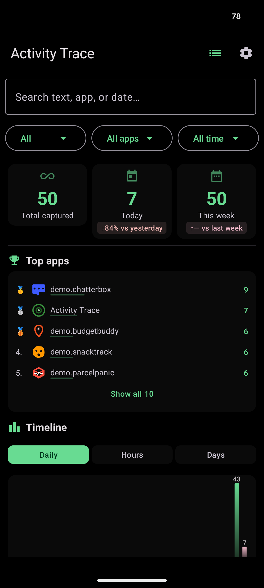
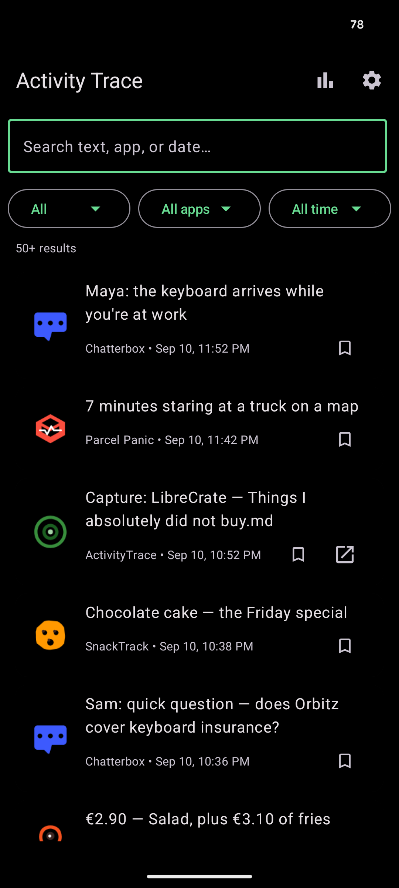

# ActivityTrace

## Find something you saw on your phone.

You know you saw it.

A notification. A message. A link. A piece of text. A file.

But now you can't remember where.

**ActivityTrace makes your Android activity searchable.**

Search across your notifications, captured screen content, and indexed files — entirely on your device.

> "tracking number DHL"
>
> "message from Sarah yesterday"
>
> "that link I saw last week"
>
> "error from Signal"

No cloud. No account. No telemetry. **No Internet permission.**

[](https://f-droid.org/en/packages/com.activitytrace/)

**[Watch the 20-second demo](#see-it-in-action)**

---

## Why ActivityTrace?

Android gives you lots of information, but finding something you saw earlier can be surprisingly difficult.

ActivityTrace creates a private, searchable memory of information your phone has already shown you.

Search it when you need it.

---

## See it in action

*[20-second demo — coming soon]*

**You saw it. Now find it.**

---

## One search for everything ActivityTrace captures

- Notifications
- Screen content
- Indexed files (documents, PDFs, images)

Everything is combined into one searchable timeline.

## Search naturally

Use ordinary language or precise filters to narrow results:

- `yesterday`
- `last week`
- `in:signal`
- `type:notification`
- `tracking number`

Prefix and wildcard matching (`test` matches `testing`, `*error` matches `fatal error`) and result highlighting are built in.

## Private by design

Your ActivityTrace database stays on your device.

- No Internet permission
- No cloud
- No account
- No telemetry, analytics, or crash reporting
- Encrypted at rest with SQLCipher + Android Keystore

**ActivityTrace cannot send your data anywhere.**

## You control your data

Choose how long captured information is kept — from 7 days to 90 days. Block individual apps from being captured entirely.

## How it works

ActivityTrace runs entirely on your device.

1. ActivityTrace captures information from the sources you enable.
2. The information is indexed in a local encrypted database.
3. You search it whenever you need it.
4. Retention rules automatically remove old data.

Nothing is uploaded to a server. There is no hidden analytics endpoint, no cloud sync, and no telemetry waiting to be disabled — the app has no network access to send anything.

**Optional capture:** Screen-content capture uses Android's AccessibilityService and is completely optional.

---

## Screenshots

    

---

## Get ActivityTrace

### F-Droid

[Install from F-Droid](https://f-droid.org/en/packages/com.activitytrace/)

### Source code

[GitHub](https://github.com/DavidNeurieder/ActivityTrace)

---

## Help shape ActivityTrace

ActivityTrace is still early, and the most useful features come from real users.

**What were you trying to find?**

[Give feedback](https://github.com/DavidNeurieder/ActivityTrace/issues) — tell us what you were looking for, what happened, and what would have made ActivityTrace useful.

Developers can report bugs and contribute directly on GitHub.

---

## Open source

ActivityTrace is free and open source software under the [GPL-3.0-only](LICENSE) license.

- No Google Play Services
- No proprietary dependencies
- No AI or ML components
- No cloud features

Contributions are welcome.

---

## Other features

- Statistics dashboard — activity over time, top apps, content-type breakdown
- Export as JSON or CSV
- Encrypted-database backup and restore (plain SQLite)

## Technical details

- Android 8.0+ (API 26)
- Jetpack Compose + Material 3
- Room + SQLCipher (AES-256-CBC) + Android Keystore
- WorkManager for retention cleanup and file indexing
- NotificationListener + AccessibilityService capture
- Storage Access Framework file indexing

### Build

```bash
./gradlew assembleDebug     # debug build (unminified)
./gradlew assembleRelease   # release build (minified, ProGuard)
./gradlew test              # unit tests
./gradlew lint              # static analysis
```

Prerequisites: JDK 17, Android SDK 36. See [`AGENTS.md`](AGENTS.md) for architecture details.
